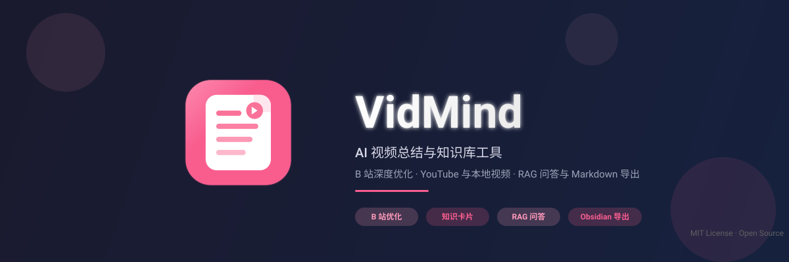

<div align="center">



[](https://www.python.org/downloads/)
[](https://opensource.org/licenses/MIT)
[](#)

[主要能力](#主要能力) · [CLI 与 Skills](#cli-与-skills) · [快速开始](#快速开始) · [文档](#文档)

</div>

---

> 深度优化 B 站体验，同时支持 YouTube 与本地视频。自动转写、总结、图文笔记、思维导图、知识库 RAG 问答，数据全部落本地。

<div align="center">
  
</div>

## CLI 与 Skills

除桌面端外，BiliSum 现在也可以通过 CLI 独立运行，或让 Codex、Claude、Cursor 等 Agent 调用。

```bash
npm install -g bilisum

bilisum summarize "https://www.bilibili.com/video/BV1xxxx"
bilisum brief "https://www.bilibili.com/video/BV1xxxx"
bilisum transcribe ./demo.mp4 --output transcript.txt
```

CLI 默认优先连接正在运行的桌面端，共用任务、配置和知识库；没有桌面端时也可以初始化一套独立环境：

```bash
bilisum env setup
bilisum --setting
```

仓库内提供 `bilisum-video-understanding` skill，让 Agent 根据请求自动选择完整总结、快速摘要、转写或任务状态查询：

```bash
npx skills add https://github.com/lycohana/BiliSum --skill bilisum-video-understanding
```

给 AI / Agent 的安装步骤见 [Skills 安装说明](docs/skills/README.md)，CLI 的环境、命令和输出格式见 [CLI 使用指南](docs/cli.md)。

## 主要能力

```
B 站 / YouTube / 本地视频  →  转写  →  文本笔记  →  图文笔记  →  思维导图  →  知识库
         ↓                          ↓                          ↓
    B 站扫码登录              可回溯的任务历史             AI 检索问答
```

### 图文笔记

VLM 理解型图文笔记会同时阅读原始笔记和视频截图，以画面信息重新组织文章。图片跟随对应的知识段落，不集中堆在文末。

- 视觉模型可以独立配置，支持 OpenAI、Anthropic、兼容接口和自定义端点
- 从候选帧提取客观事实，过滤低质量画面并精选配图
- 支持纯文本、按时间插图和 VLM 理解型三种形式

<div align="center">
  
  <p><i>段落与截图交替排列的图文笔记</i></p>
</div>

### 转写、笔记与思维导图

- SiliconFlow ASR、多模态 ASR、本地 Whisper、FunASR（QwenASR）
- 结构化摘要、章节时间轴、转写全文、知识笔记与重跑机制
- 思维导图支持缩放、拖拽和节点高亮
- 多 P 视频可批量处理，也可以生成全集总结

### 知识库

- 跨视频语义检索、关键词检索与 RAG 问答
- 自动 / 手动标签与标签关系网络
- 支持本地 Embedding 和本地 LLM，笔记、索引与配置保存在本机

<div align="center">
  
  <p><i>跨视频检索、问答与标签管理</i></p>
</div>

### 桌面端与导入导出

- Windows / macOS 桌面端，内置 B 站扫码登录和应用内更新
- 导入 B 站、YouTube 和本地视频（mp4 / mkv / mov / webm）
- 导出 Markdown、Obsidian 格式，可打包笔记和截图
- 本地视频可选接入 Twelve Labs Pegasus，补充字幕之外的画面信息

## 快速开始

### 桌面端

从 [GitHub Releases](https://github.com/lycohana/BiliSum/releases) 下载 Windows 或 macOS 安装包。首次启动后在设置页配置一组转写服务和 LLM；遇到 B 站风控时，优先使用桌面端内置的扫码登录。

### CLI

```bash
npm install -g bilisum
bilisum env
bilisum summarize "https://www.bilibili.com/video/BV1xxxx"
```

未安装桌面端时，先运行 `bilisum env setup` 初始化独立环境（需要 Python 3.12），再用 `bilisum --setting` 打开设置页。完整步骤见 [CLI 使用指南](docs/cli.md)。

### Docker

```bash
docker pull lycohana/bilisum:latest
docker run --rm -p 3838:3838 -v bilisum-data:/data \
  -e VIDEO_SUM_ACCESS_TOKEN=your-token \
  lycohana/bilisum:latest
```

访问 `http://127.0.0.1:3838`。LLM、ASR、知识库和视觉模型的配置见 [配置说明](docs/configuration.md)。

### 从源码运行

开发环境需要 Python 3.12、Node.js 20+ 和 `uv`：

```powershell
uv sync --python 3.12 --all-packages
npm install --prefix .\apps\desktop
npm run dev
```

测试、打包、项目结构和发布流程见 [贡献指南](docs/contributing.md)。

## 技术栈

| 模块 | 技术选型 |
|------|----------|
| 桌面端 | Electron + React + TypeScript + Vite |
| 后端服务 | FastAPI + SQLite |
| 视频处理 | yt-dlp + ffmpeg |
| 模型接入 | OpenAI-compatible / Anthropic / 本地模型 / Twelve Labs（可选） |
| 知识库 | Embedding 检索 + LLM Agent |
| 打包分发 | PyInstaller + electron-builder + Docker |

## 配置

桌面端和 CLI 独立环境都可以通过设置页配置。环境变量、Docker 部署和配置优先级见 [配置说明](docs/configuration.md)。

## 文档

| 文档 | 内容 |
|------|------|
| [Skills 安装说明](docs/skills/README.md) | 给 AI / Agent 阅读的 skill 安装、验证与更新步骤 |
| [CLI 使用指南](docs/cli.md) | 命令、环境、输出格式、服务生命周期与常见问题 |
| [配置说明](docs/configuration.md) | 设置来源、环境变量、Docker 与 CLI 配置 |
| [贡献指南](docs/contributing.md) | 开发环境、项目结构、测试、PR 与发布流程 |
| [文档索引](docs/README.md) | 仓库内文档入口 |

## 贡献

遇到 Bug 或有想法可以开 Issue；修复、加功能或优化体验可以提交 PR。完整流程见 [贡献指南](docs/contributing.md)。

## License

MIT License © 2026 Lycohana

特别致谢：[Linux Do](https://linux.do)
